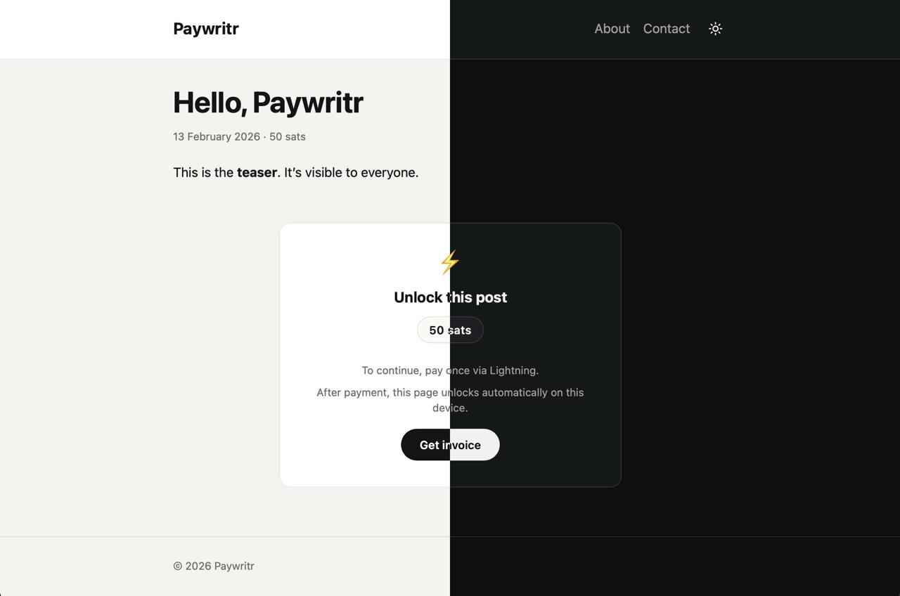

# Paywritr

**Minimal writing. Pay per post.**

A hyper-minimalist flat-file blog engine with built-in Lightning Network paywalls. Write in Markdown, set a price in sats, and get paid instantly via Alby Hub or LNbits.



### Features

-   **Zero friction:** No accounts, no login. Readers pay once and unlock content on their device.
-   **Flat-file:** No database. Just Markdown files.
-   **Self-sovereign:** Money goes directly to your wallet (NWC/LNbits).
-   **Themeable:** Simple HTML/CSS themes.
-   **Lightweight:** Small Node.js server, runs anywhere (Docker/VPS/Raspberry Pi).

---

## 1. Prerequisites

Before running Paywritr, you need a Lightning wallet connection.

-   [**Alby Hub (Recommended):**](https://getalby.com/) Connects via Nostr Wallet Connect. You will need your Hub's **Connection Secret** (NWC URL).
-   [**LNbits (Advanced):**](https://lnbits.com) Connects to an LNbits instance. You will need your **Invoice/Read Keys** and instance URL.

---

## 2. Setup & Configuration

**1. Get the files**
Start by getting the example configuration and content structure.

```bash
git clone https://github.com/drytidelabs/paywritr.git my-blog
cd my-blog \
```

**2. Configure Site Metadata (`site.yml`)**
Public info about your blog (title, description, timezone).
```bash
cp site.yml.example site.yml
```
Edit site.yml to match your brand

**3. Configure Secrets (`.env`)**
Private keys and connection strings.
```bash
cp .env.example .env
```
Edit .env: Set APP_SECRET and your Payment Provider details

---

## 3. How to Run

### Option A: Docker Compose (Recommended)

Ideal for production. Paywritr provides a default `docker-compose.yml`.

**1. Review Volumes**
Open `docker-compose.yml` and check the `volumes:` section. By default, it expects your content and config to be in the current directory:

```yaml
volumes:
  - ./content:/app/content       # Where your Markdown posts live
  - ./site.yml:/app/site.yml:ro  # Your site config
```
*If you keep your content elsewhere (e.g. `/var/data/blog`), update the left side of these paths.*

**2. Run**
```bash
docker compose up -d
```
This pulls the official image (`ghcr.io/drytidelabs/paywritr:latest`) and starts the server on port 3000.

### Option B: Docker CLI

Run the container directly, manually mounting your config files:

```bash
docker run -d -p 3000:3000 \
  --name paywritr \
  --env-file .env \
  -v $(pwd)/content:/app/content \
  -v $(pwd)/site.yml:/app/site.yml:ro \
  ghcr.io/drytidelabs/paywritr:latest
```

### Option C: Local Node.js

For development or bare-metal hosting. Requires Node.js 20+.

```bash
npm ci
npm start
```
Visit `http://localhost:3000`.

---

## 4. Content Creation

Posts live in your local `content/posts/` folder (or wherever you pointed the Docker volume).

**Example Post:**
```yaml
---
title: My Premium Story
slug: my-story
published_date: "2026-02-24"
price_sats: 500
summary: A teaser for the homepage.
---

This is the free teaser text shown to everyone.

<!--more-->

## The Paid Section
Everything below the "more" marker is hidden behind the paywall until purchased.
```

**Images:**
Place images in `content/assets/` and reference them like this:
```markdown

```

---

## 5. Documentation

Detailed guides are available in `docs/`:

-   [**Configuration**](docs/configuration.md) - Full list of options and `site.yml` keys.
-   [**Payments**](docs/payments.md) - Deep dive on Alby/LNbits setup.
-   [**Deploy**](docs/deploy.md) - Production guides (HTTPS, Reverse Proxy).
-   [**Theming**](docs/theme_authoring.md) - How to create custom themes.

---

## License

MIT © [Drytide Labs](https://github.com/drytidelabs)
